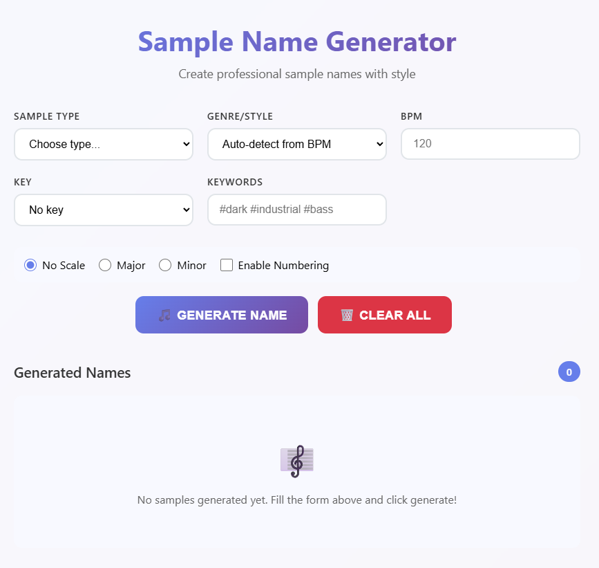
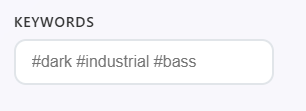
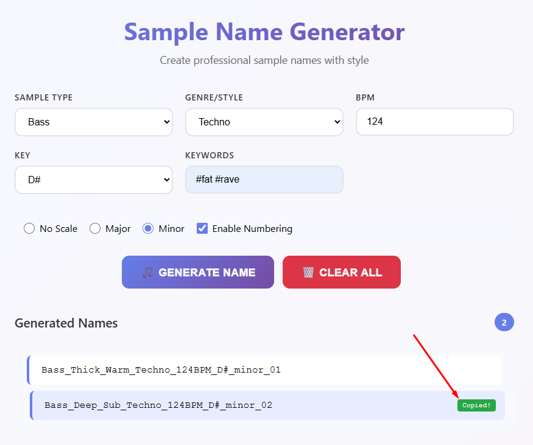
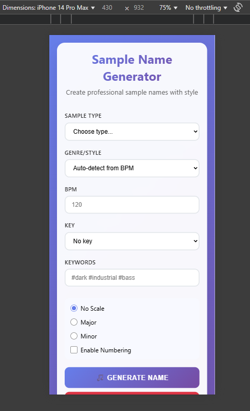

# 🎵 Sample Name Generator

<div align="center">

**Create professional sample names with style**

[](https://your-username.github.io/sample-name-generator)
[](LICENSE)
[](https://developer.mozilla.org/en-US/docs/Web/HTML)
[](https://developer.mozilla.org/en-US/docs/Web/CSS)
[](https://developer.mozilla.org/en-US/docs/Web/JavaScript)

</div>

## 📖 Overview

**Sample Name Generator** — это веб-приложение для создания профессиональных названий музыкальных семплов. Инструмент помогает продюсерам, битмейкерам и музыкантам генерировать структурированные и информативные имена файлов, следуя индустриальным стандартам.

## 📸 Screenshots

<div align="center">

### 🎨 Main Interface


*Основной интерфейс приложения с формой генерации*

### 🏷️ Keywords in Action  


*Демонстрация работы системы keywords*

### 📋 Generated Results


*Панель с сгенерированными названиями и функцией копирования*

### 📱 Mobile View


*Адаптивный дизайн для мобильных устройств*

</div>

> **📝 Note for screenshots:**
> - Покажите заполненную форму с примером keywords
> - Включите панель результатов с несколькими названиями
> - Продемонстрируйте hover эффекты на результатах
> - Сделайте снимок мобильной версии

### ✨ Key Features

- 🎛️ **Множественные типы семплов** — от басов до вокалов
- 🎵 **Автоопределение жанра** по BPM
- 🏷️ **Система ключевых слов** для тонкой настройки
- 🎹 **Поддержка тональностей** и ладов
- 📝 **Система нумерации** для серий семплов
- 📋 **Копирование в буфер** одним кликом
- 🎨 **Современный UI/UX**

## 🚀 Quick Start

1. **Клонируйте репозиторий:**
   ```bash
   git clone https://github.com/your-username/sample-name-generator.git
   cd sample-name-generator
   ```

2. **Откройте `index.html` в браузере** или используйте локальный сервер:
   ```bash
   # Используя Python
   python -m http.server 8000
   
   # Используя Node.js
   npx serve .
   ```

3. **Начните генерировать!** Выберите тип семпла и нажмите "Generate Name"

## 📋 How to Use

### Basic Usage

1. **Выберите Sample Type** — определяет основу названия
2. **Укажите BPM** — для автоматического определения жанра
3. **Добавьте Keywords** — для настройки настроения
4. **Нажмите Generate** — получите профессиональное название

### 🎯 Example Output

<div style="background: #f8f9ff; border-radius: 12px; padding: 20px; margin: 20px 0;">
  <div style="background: white; padding: 15px 20px; margin-bottom: 10px; border-radius: 8px; border-left: 4px solid #667eea; font-family: 'JetBrains Mono', 'Courier New', monospace; position: relative;">
    <span>Bass_Deep_Heavy_Techno_128BPM_Am_minor_01</span>
    <span style="position: absolute; right: 15px; top: 50%; transform: translateY(-50%); color: #666; font-size: 0.8rem;">Click to copy</span>
  </div>
  <div style="background: white; padding: 15px 20px; margin-bottom: 10px; border-radius: 8px; border-left: 4px solid #667eea; font-family: 'JetBrains Mono', 'Courier New', monospace; position: relative;">
    <span>Lead_Sharp_Cutting_Trance_138BPM</span>
    <span style="position: absolute; right: 15px; top: 50%; transform: translateY(-50%); color: #666; font-size: 0.8rem;">Click to copy</span>
  </div>
  <div style="background: white; padding: 15px 20px; border-radius: 8px; border-left: 4px solid #667eea; font-family: 'JetBrains Mono', 'Courier New', monospace; position: relative;">
    <span>Kick_Punchy_Industrial_140BPM</span>
    <span style="position: absolute; right: 15px; top: 50%; transform: translateY(-50%); color: #666; font-size: 0.8rem;">Click to copy</span>
  </div>
</div>

## 🏷️ Keywords System

### 💡 Что такое Keywords?

**Keywords (ключевые слова)** — это **мощный инструмент для управления настроением и стилем** генерируемых названий. Они позволяют точно передать характер вашего семпла и помогают другим музыкантам быстро понять, что ожидать от трека.

### 📝 Формат ввода

**Keywords можно вводить в различных форматах:**
```
#dark #industrial #bass
dark, industrial, bass
dark industrial bass
#acid #303 #squelchy
```


### 🎨 Категории Keywords

<div style="display: grid; grid-template-columns: 1fr 1fr; gap: 20px; margin: 20px 0;">

<div style="background: linear-gradient(135deg, #1a1a2e 0%, #16213e 100%); color: white; padding: 20px; border-radius: 12px;">
<h4 style="margin-bottom: 15px; color: #fff;">🌑 Mood & Atmosphere</h4>
<div style="margin-bottom: 8px;"><code style="background: rgba(255,255,255,0.1); padding: 3px 6px; border-radius: 4px;">#dark</code> → Industrial, Sinister, Haunting</div>
<div style="margin-bottom: 8px;"><code style="background: rgba(255,255,255,0.1); padding: 3px 6px; border-radius: 4px;">#ambient</code> → Atmospheric, Floating, Dreamy</div>
<div style="margin-bottom: 8px;"><code style="background: rgba(255,255,255,0.1); padding: 3px 6px; border-radius: 4px;">#hard</code> → Aggressive, Brutal, Intense</div>
<div style="margin-bottom: 8px;"><code style="background: rgba(255,255,255,0.1); padding: 3px 6px; border-radius: 4px;">#soft</code> → Gentle, Smooth, Mellow</div>
<div style="margin-bottom: 8px;"><code style="background: rgba(255,255,255,0.1); padding: 3px 6px; border-radius: 4px;">#melodic</code> → Ethereal, Emotional, Progressive</div>
</div>

<div style="background: linear-gradient(135deg, #667eea 0%, #764ba2 100%); color: white; padding: 20px; border-radius: 12px;">
<h4 style="margin-bottom: 15px; color: #fff;">🔧 Technical & Style</h4>
<div style="margin-bottom: 8px;"><code style="background: rgba(255,255,255,0.1); padding: 3px 6px; border-radius: 4px;">#industrial</code> → Mechanical, Raw, Metallic</div>
<div style="margin-bottom: 8px;"><code style="background: rgba(255,255,255,0.1); padding: 3px 6px; border-radius: 4px;">#vintage</code> → Retro, Classic, Analog</div>
<div style="margin-bottom: 8px;"><code style="background: rgba(255,255,255,0.1); padding: 3px 6px; border-radius: 4px;">#modern</code> → Digital, Clean, Contemporary</div>
<div style="margin-bottom: 8px;"><code style="background: rgba(255,255,255,0.1); padding: 3px 6px; border-radius: 4px;">#glitch</code> → Broken, Stuttered, Fragmented</div>
<div style="margin-bottom: 8px;"><code style="background: rgba(255,255,255,0.1); padding: 3px 6px; border-radius: 4px;">#organic</code> → Natural, Live, Human</div>
</div>

</div>

### 🎛️ Instrument-Specific Keywords

<details>
<summary><strong>🔊 Bass Keywords</strong></summary>

- `#bass` → Sub, Deep, Heavy, Rumbling, 808, Wobble
- `#sub` → Для глубоких частот
- `#808` → Для trap и hip-hop стилей
- `#wobble` → Для dubstep басов

**Пример:** `#bass #dark #sub` → `Bass_Sub_Deep_Industrial_128BPM`
</details>

<details>
<summary><strong>🎵 Melodic Keywords</strong></summary>

- `#acid` → 303, Squelchy, Resonant, Filtered
- `#melodic` → Ethereal, Emotional, Progressive
- `#ambient` → Atmospheric, Floating, Spacious

**Пример:** `#acid #303` → `Lead_Squelchy_303_Acidic_138BPM`
</details>

<details>
<summary><strong>🥁 Percussion Keywords</strong></summary>

- `#hard` → Для aggressive drums
- `#vintage` → Для classic breaks
- `#glitch` → Для experimental percussion

**Пример:** `#hard #industrial` → `Kick_Aggressive_Metallic_Brutal_140BPM`
</details>

### 🎯 Best Practices для Keywords

#### ✅ Do's
- **Комбинируйте 2-3 keywords** для точного описания
- **Используйте контрастные keywords** для уникальности
- **Думайте о настроении** трека при выборе
- **Учитывайте жанр** и BPM

#### ❌ Don'ts
- Не используйте слишком много keywords (>5)
- Не смешивайте противоречивые стили
- Не дублируйте информацию из других полей

### 🎭 Creative Combinations

<div style="overflow-x: auto; margin: 20px 0;">
<table style="width: 100%; border-collapse: collapse; background: white; border-radius: 12px; overflow: hidden; box-shadow: 0 4px 6px rgba(0,0,0,0.1);">
<thead>
<tr style="background: linear-gradient(135deg, #667eea 0%, #764ba2 100%); color: white;">
<th style="padding: 15px; text-align: left; font-weight: 600;">Combination</th>
<th style="padding: 15px; text-align: left; font-weight: 600;">Result Style</th>
<th style="padding: 15px; text-align: left; font-weight: 600;">Best For</th>
</tr>
</thead>
<tbody>
<tr style="border-bottom: 1px solid #e1e5e9;">
<td style="padding: 12px; font-family: 'JetBrains Mono', monospace; background: #f8f9ff;"><code>#dark #industrial</code></td>
<td style="padding: 12px;">Sinister, Mechanical, Raw</td>
<td style="padding: 12px;">Techno, Industrial</td>
</tr>
<tr style="border-bottom: 1px solid #e1e5e9;">
<td style="padding: 12px; font-family: 'JetBrains Mono', monospace; background: #f8f9ff;"><code>#vintage #warm</code></td>
<td style="padding: 12px;">Retro, Analog, Classic</td>
<td style="padding: 12px;">Lo-Fi, House</td>
</tr>
<tr style="border-bottom: 1px solid #e1e5e9;">
<td style="padding: 12px; font-family: 'JetBrains Mono', monospace; background: #f8f9ff;"><code>#acid #303</code></td>
<td style="padding: 12px;">Squelchy, Resonant, TB</td>
<td style="padding: 12px;">Acid House/Techno</td>
</tr>
<tr style="border-bottom: 1px solid #e1e5e9;">
<td style="padding: 12px; font-family: 'JetBrains Mono', monospace; background: #f8f9ff;"><code>#ambient #melodic</code></td>
<td style="padding: 12px;">Atmospheric, Emotional, Dreamy</td>
<td style="padding: 12px;">Trance, Ambient</td>
</tr>
<tr>
<td style="padding: 12px; font-family: 'JetBrains Mono', monospace; background: #f8f9ff;"><code>#glitch #modern</code></td>
<td style="padding: 12px;">Broken, Digital, Stuttered</td>
<td style="padding: 12px;">IDM, Experimental</td>
</tr>
</tbody>
</table>
</div>

## 🎵 Sample Types Guide

### 🎹 Tonal Instruments
- **Bass** — Low-frequency foundation elements
- **Lead** — Melodic lead lines and hooks
- **Pluck** — Short, percussive melodic elements
- **Synth** — General synthesizer sounds
- **Pad** — Atmospheric background textures
- **Keys** — Piano, electric piano, organ sounds

### 🥁 Percussion
- **Kick** — Bass drum hits
- **Snare** — Snare drum samples
- **Hi-Hat** — Closed hi-hat sounds
- **Open Hat** — Open hi-hat samples
- **Perc** — General percussion elements

### 🎤 Other
- **Loop** — Complete musical phrases
- **One Shot** — Single hit samples
- **Vocal** — Voice samples and chops
- **FX** — Sound effects and transitions

## ⚡ Advanced Features

### 🔢 Numbering System
Включите "Enable Numbering" для создания серий:

<div style="background: #f8f9ff; border-radius: 12px; padding: 20px; margin: 15px 0;">
  <div style="background: white; padding: 12px 16px; margin-bottom: 8px; border-radius: 8px; border-left: 4px solid #28a745; font-family: 'JetBrains Mono', monospace; font-size: 0.9rem;">
    Bass_Deep_Techno_128BPM_01
  </div>
  <div style="background: white; padding: 12px 16px; margin-bottom: 8px; border-radius: 8px; border-left: 4px solid #28a745; font-family: 'JetBrains Mono', monospace; font-size: 0.9rem;">
    Bass_Deep_Techno_128BPM_02
  </div>
  <div style="background: white; padding: 12px 16px; border-radius: 8px; border-left: 4px solid #28a745; font-family: 'JetBrains Mono', monospace; font-size: 0.9rem;">
    Bass_Deep_Techno_128BPM_03
  </div>
</div>

### 🎼 Key & Scale Detection
Добавьте тональность для более точной категоризации:

<div style="background: #f8f9ff; border-radius: 12px; padding: 20px; margin: 15px 0;">
  <div style="background: white; padding: 12px 16px; margin-bottom: 8px; border-radius: 8px; border-left: 4px solid #667eea; font-family: 'JetBrains Mono', monospace; font-size: 0.9rem;">
    Lead_Sharp_Trance_138BPM_Am_minor
  </div>
  <div style="background: white; padding: 12px 16px; border-radius: 8px; border-left: 4px solid #667eea; font-family: 'JetBrains Mono', monospace; font-size: 0.9rem;">
    Pad_Warm_Ambient_90BPM_C_major
  </div>
</div>

### 🎵 BPM-Based Genre Detection
Приложение автоматически определяет жанр по BPM:
- **70-90 BPM** → Hip-Hop, Trap, Downtempo
- **110-130 BPM** → House, Techno, Progressive
- **140+ BPM** → Dubstep, DnB, Hardcore

## 🛠️ Technical Details

### File Structure
```
sample-name-generator/
├── index.html          # Main HTML file
├── script.js           # Core JavaScript logic
├── styles.css          # CSS styling
└── README.md           # This documentation
```

### Browser Support
- ✅ Chrome 60+
- ✅ Firefox 55+
- ✅ Safari 11+
- ✅ Edge 79+

### Используемые технологии
- **HTML5** — структура и семантика
- **CSS3** — современный стиль с Grid и Flexbox
- **Vanilla JavaScript** — без зависимостей
- **Clipboard API** — функция копирования

## 🚀 Deployment

### GitHub Pages
1. Отправьте свой код в GitHub.
2. Перейдите в Settings → Pages
3. Выберите исходную ветвь (обычно `main`)
4. Ваш сайт будет доступен по адресу `https://username.github.io/repository-name` - обратите внимание на поле `username` это ваш логин github

## 🤝 Для помощи в разработке

1. Создайте форк репозитория
2. Создайте ветку функции:  `git checkout -b feature-name`
3. Зафиксируйте изменения: `git commit -m 'Add feature'`
4. Отправьте в ветку: `git push origin feature-name`
5. Отправьте запрос на слияние (Pull Request)

## 📝 License

This project is licensed under the MIT License - see the [LICENSE](LICENSE) file for details.

## 🎯 Будущие функции

- [ ] Функция экспорта в CSV
- [ ] Пользовательские библиотеки прилагательных
- [ ] Режим пакетного создания
- [ ] Интеграция аудиофайлов
- [ ] Система шаблонов
- [ ] Dark/Light темы

---

<div align="center">

**Made with ❤️ for the music production community**

[Report Bug](https://github.com/your-username/sample-name-generator/issues) · [Request Feature](https://github.com/your-username/sample-name-generator/issues) · [Contribute](https://github.com/your-username/sample-name-generator/pulls)

</div>